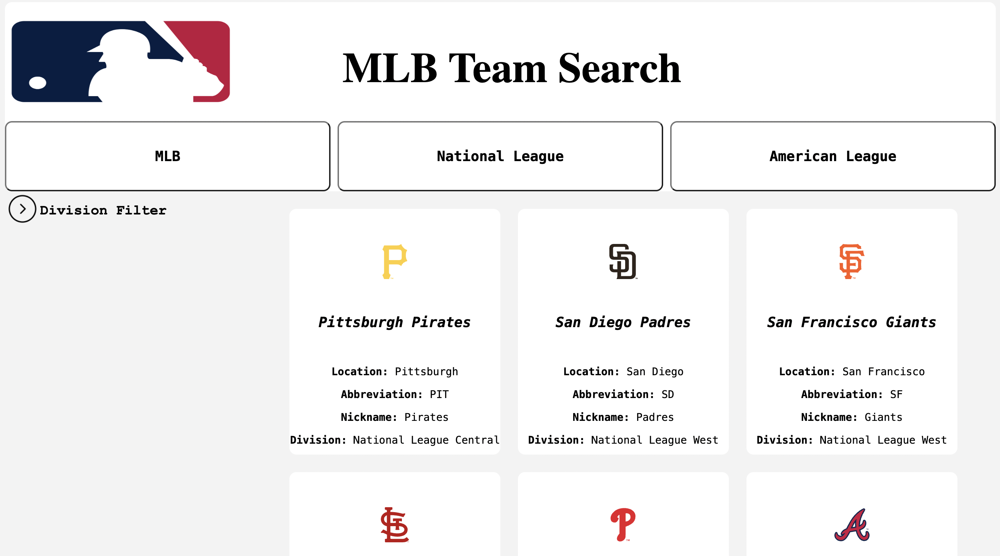

# Getting Started

This project requires nodejs, https://nodejs.org/en/download

# Brewers Application Intern Project

This project is a web application that retrieves and displays team data for the Major League Baseball (MLB). The application is built with React and Node.js, and uses the axios library to make HTTP requests to an API.

## Features

- Retrieves team data from an external API.
- Filters teams by league, and can filter each league/All of MLB by division.
- Displays team data in a user-friendly format.

## Packages 

- Axios
- Express
- CORS
- React

## How to Run 
### In the project directory, you can run:

`cd Backend`\
`npm install`\
`node index.js`

This changes the directory to the backend. Installs the dependecies for the backend. Then runs the backend server in development mode.

Open http://localhost:3000/api/teams to view it in your browser.

### Then in a seperate terminal:

`cd Frontend`\
`npm install`\
`npm run dev`

This changes directory to the frontend. Installs the dependencies for the backend. Then runs the frontend in development mode. 

Open [localhost:5173 ](http://localhost:5173/) to view it in your browser. 